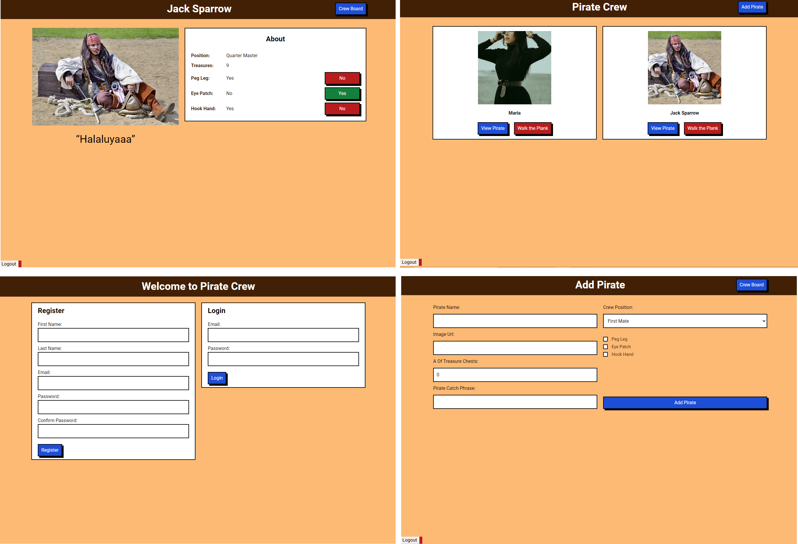

# Black Belt

Simple responsive design mern stack TypeScript project where we can register, login and logout users, add, update, delete and list pirates.

## Table of contents

- [Overview](#overview)
  - [The challenge](#the-challenge)
  - [Screenshot](#screenshot)
  - [Links](#links)
- [My process](#my-process)
  - [Built with](#built-with)
- [Author](#author)

## Overview

### This project

Users should be able to:

- View the optimal layout for the app depending on their device's screen size
- See hover states for all interactive elements on the page
- Create, read, update, and delete pirate
- User register, login and logout

### Screenshot

### Links

- Live Site URL: [https://black-belt-gold.vercel.app/](https://black-belt-gold.vercel.app/)

## My process

### Built with

#### Frontend

- Semantic HTML5 markup
- CSS custom properties
- Flexbox
- CSS Grid
- Mobile-first workflow
- Axios
- TypeScript
- [React](https://reactjs.org/) - JS library
- [Styled Components](https://styled-components.com/) - For styles

#### Backend

- NodeJS
- Express
- TypeScript
- Mongoose
- JsonWebtoken
- Bcryptjs
- http-status-codes
- express-async-errors

## Author

- LinkedIn - [Doğukan Variş](https://www.linkedin.com/in/dogukanvaris/)
